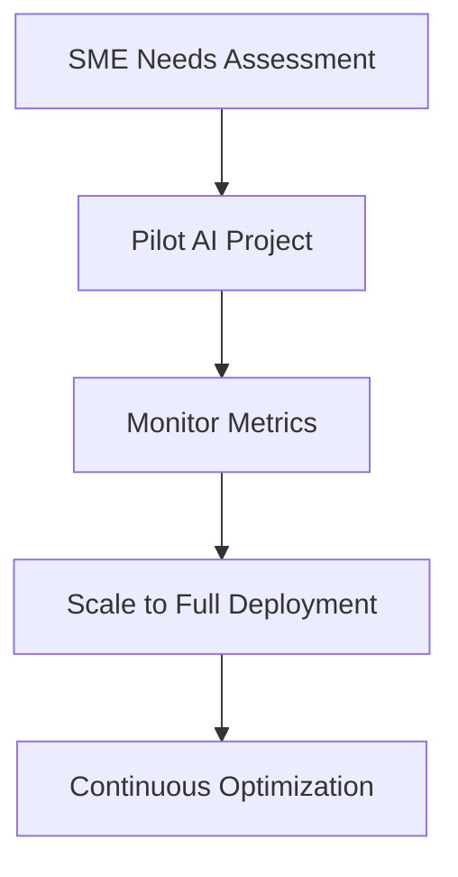

## Overview

NuaLogic equips Irish SMEs with AI strategies, process automation, and fractional CIO expertise to drive growth. You grasp these core concepts to align technology with business goals. Understand basics of AI for business, process automation fundamentals, fractional CIO roles, ethical implementation, and SME scalability.

<Columns cols={3}>
  <Card title="AI Basics" icon="zap" href="#">
    Learn how AI transforms decision-making and efficiency.
  </Card>
  <Card title="Process Automation" icon="settings" href="#">
    Automate repetitive tasks to free your team.
  </Card>
  <Card title="Fractional CIO" icon="shield" href="#">
    Get executive tech leadership without full-time cost.
  </Card>
  <Card title="Ethical AI" icon="help-circle" href="#">
    Implement responsibly to build trust.
  </Card>
  <Card title="SME Scalability" icon="trending-up" href="#">
    Scale AI solutions affordably for growth.
  </Card>
</Columns>

## AI Basics for Business

AI analyzes data to predict outcomes and automate decisions. You use machine learning models to forecast sales or detect fraud. NuaLogic tailors models like regression for Irish retail SMEs.

<Callout kind="tip">
  Start with clear business problems before selecting AI tools.
</Callout>

## Process Automation Fundamentals

Automation streamlines workflows using tools like RPA (Robotic Process Automation). You integrate scripts to handle invoice processing or customer onboarding.

<Steps>
  <Step title="Identify Tasks" icon="search">
    List repetitive manual processes in your operations.
  </Step>
  <Step title="Choose Tools" icon="package">
    Select RPA platforms like UiPath or open-source options.
  </Step>
  <Step title="Build Bots" icon="code">
    Develop scripts to mimic human actions.

````python
import pyautogui
import time

# Simulate invoice data entry
pyautogui.write('Invoice #12345')
pyautogui.press('tab')
pyautogui.write('€500.00')
pyautogui.press('enter')
time.sleep(1)
````

  </Step>
  <Step title="Monitor & Scale" icon="bar-chart">
    Track ROI and expand to more processes.
  </Step>
</Steps>

## Role of Fractional CIO

A fractional CIO provides part-time strategic tech leadership. You gain C-suite insights on AI adoption without hiring full-time. NuaLogic's experts align IT with Dublin SME growth plans.

## Ethical AI Implementation

Prioritize fairness, transparency, and privacy. You audit models for bias and comply with GDPR. Ethical practices prevent reputational risks.

<Tabs>
  <Tab title="Bias Detection" icon="alert-triangle">
    Review training data for imbalances.

````python
import pandas as pd
df = pd.read_csv('customer_data.csv')
print(df['gender'].value_counts())  # Check distribution
````

  </Tab>
  <Tab title="Transparency" icon="eye">
    Document model decisions for audits.
  </Tab>
</Tabs>

## Scalability for SMEs

Scale AI incrementally. Start with pilot projects, then expand. NuaLogic ensures cloud-based solutions grow with your revenue.



<Expandable title="Advanced Scaling Tips" default-open="false">

Use serverless architectures for cost efficiency.

<CodeGroup tabs="Python,Node.js">
```python
# AWS Lambda for scalable inference
import boto3
lambda_client = boto3.client('lambda')
response = lambda_client.invoke(FunctionName='ai-model')
```
```javascript
// Node.js serverless function
const AWS = require('aws-sdk');
const lambda = new AWS.Lambda();
const params = { FunctionName: 'ai-model' };
lambda.invoke(params, (err, data) => { console.log(data); });
```
</CodeGroup>

</Expandable>

| Concept | Benefit for SMEs | NuaLogic Service |
|---------|------------------|------------------|
| AI Basics | Predictive insights | Strategy workshops |
| Automation | 40% time savings | RPA implementation |
| Fractional CIO | Expert guidance | Part-time leadership |
| Ethical AI | Compliance & trust | Audits & training |
| Scalability | Cost-effective growth | Cloud migration |