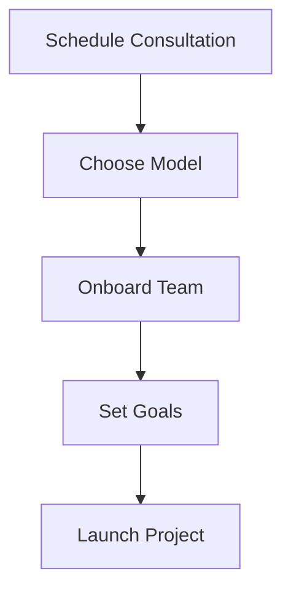

## Overview

NuaLogic empowers Irish SMEs with AI strategies, process automation, and fractional CIO expertise. Follow these steps to start your transformation journey, from free consultation to project launch. Expect tailored advice that drives growth and innovation.

<Columns cols={3}>
  <Card title="Free Consultation" icon="calendar" href="https://nualogic.ie/consultation">
    Schedule your 30-minute discovery call.
  </Card>
  <Card title="Engagement Models" icon="layers" href="#engagement-models">
    Explore flexible options for your needs.
  </Card>
  <Card title="Launch Project" icon="rocket" href="#project-goals">
    Define goals and go live quickly.
  </Card>
</Columns>



## Schedule Your Free Consultation

Begin by booking a no-obligation call. Discuss your challenges in AI adoption or automation.

<Steps>
  <Step title="Visit Booking Page" icon="globe">
    Go to the [NuaLogic consultation page](https://nualogic.ie/consultation).
  </Step>
  <Step title="Select Availability" icon="calendar">
    Choose a time slot that suits your team.
  </Step>
  <Step title="Prepare Questions" icon="edit-3">
    Note pain points like `process bottlenecks` or AI integration needs.
  </Step>
</Steps>

<Callout kind="tip">
  Prepare data on your current workflows. This helps us provide targeted insights during the call.
</Callout>

## Choose Your Engagement Model

Select from flexible models designed for SMEs. Each suits different project scopes.

<Tabs>
  <Tab title="Fractional CIO" icon="shield">
    Gain dedicated strategic leadership without full-time hire.
    
    Benefits:
    - Quarterly roadmaps
    - Vendor management
    - 10-20 hours/week commitment
    
    Ideal for scaling AI infrastructure.
  </Tab>
  <Tab title="Project-Based" icon="target">
    Fixed-scope delivery for specific automation projects.
    
    Includes:
    - AI model deployment
    - Custom scripts
    - 4-12 week timelines
    
    Perfect for one-off transformations.
  </Tab>
  <Tab title="Retainer" icon="repeat">
    Ongoing support for continuous optimization.
    
    Covers:
    - Monthly automation tweaks
    - Performance audits
    - Unlimited consultations
    
    Suited for evolving business needs.
  </Tab>
</Tabs>

## Onboarding Process

Once you select a model, we streamline setup.

<Steps>
  <Step title="Sign Agreement" icon="file-signature">
    Review and e-sign the engagement terms.
  </Step>
  <Step title="Team Kickoff" icon="users">
    Join a 1-hour virtual meeting to align expectations.
  </Step>
  <Step title="Access Setup" icon="key">
    Share repositories and tools. Here's a sample GitHub setup:
    
    <CodeGroup tabs="CLI,Web">
    ````bash
    gh repo create my-nualogic-project --public --source=.
    gh repo deploy-key add ~/.ssh/id_rsa.pub --name "NuaLogic Deploy"
    ````
    
    ````bash
    # Log in to GitHub CLI
    gh auth login
    
    # Create repo
    gh repo create nualogic-automation --public
    
    # Add SSH key for deployments
    gh api repos/:owner/:repo/keys -X POST -f title="NuaLogic" -f key="$(cat ~/.ssh/id_rsa.pub)"
    ````
    </CodeGroup>
  </Step>
</Steps>

## Define Project Goals

Collaborate to set SMART goals: Specific, Measurable, Achievable, Relevant, Time-bound.

<ExpandableGroup>
  <Expandable title="Example Goals" default-open="true">
    - Automate invoice processing: Reduce manual entry by `>80%` in 6 weeks.
    - Deploy AI chatbot: Handle `>50%` customer queries autonomously.
    - CIO roadmap: Identify `3` high-impact AI use cases quarterly.
  </Expandable>
  <Expandable title="Goal-Setting Workshop">
    We facilitate a 2-hour session using tools like Miro boards.
    
    Output: Prioritized backlog with milestones.
  </Expandable>
</ExpandableGroup>

<Callout kind="success">
  Your first project launches within 2 weeks of onboarding. Track progress via shared dashboards.
</Callout>

<Columns cols={2}>
  <Card title="Next: AI Quick Wins" icon="zap" href="/docs/ai-strategies">
    Explore starter automation scripts.
  </Card>
  <Card title="Contact Us" icon="mail" href="mailto:hello@nualogic.ie">
    Questions? Email our team.
  </Card>
</Columns>