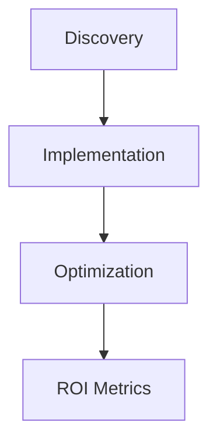

## Overview

NuaLogic, a Dublin-based technology consultancy, helps Irish SMEs unlock growth through AI strategies, process automation, and fractional CIO services. You gain access to expert guidance that aligns cutting-edge tech with your business goals, reducing costs and boosting efficiency.

<Columns cols={3}>
  <Card title="AI Strategy" icon="zap" href="#">
    Develop tailored AI roadmaps to integrate machine learning into your operations.
  </Card>
  <Card title="Process Automation" icon="settings" href="#">
    Streamline workflows with RPA and custom scripts for measurable time savings.
  </Card>
  <Card title="Fractional CIO" icon="shield" href="#">
    Get executive-level IT leadership without full-time overhead.
  </Card>
</Columns>

## AI Strategy Development

You start by assessing your current operations to identify AI opportunities. NuaLogic's consultants audit data assets and define use cases like predictive analytics for sales forecasting.

<Steps>
  <Step title="Discovery" icon="search">
    Map your data sources and business pain points.
  </Step>
  <Step title="Roadmap" icon="map">
    Prioritize projects with ROI projections.
  </Step>
  <Step title="Implementation" icon="rocket">
    Deploy pilot models and scale successfully.
  </Step>
</Steps>

<Callout kind="tip">
  Focus on low-hanging fruit: Start with AI for customer segmentation using tools like scikit-learn.
</Callout>

## Process Automation Implementation

Automate repetitive tasks to free your team. NuaLogic implements RPA for invoice processing or inventory management, often using Python libraries.

<Tabs>
  <Tab title="Python RPA" icon="code">
    Use libraries like RPA Framework for browser automation.

    <CodeGroup tabs="Python,Bash">
```python
from rpa_framework import RPA

rpa = RPA()
rpa.open_url("https://invoices.example.com")
rpa.extract_table("table#invoices")
rpa.save_table("invoices.xlsx")
```
```bash
pip install rpaframework
python automate_invoices.py
```
    </CodeGroup>
  </Tab>
  <Tab title="Zapier Integration" icon="zap">
    Connect apps without code for quick wins.

    Create zaps linking your CRM to accounting software.
  </Tab>
</Tabs>

## Fractional CIO Advisory Services

You hire NuaLogic's fractional CIO for strategic IT oversight. They handle cloud migrations, cybersecurity audits, and vendor selection, reporting quarterly.

<Expandable title="Typical Engagement" default-open="true">
  - Monthly strategy sessions
  - Tech stack reviews
  - Crisis response planning
</Expandable>

## Customization for Irish SMEs

NuaLogic tailors services to comply with GDPR and Revenue.ie requirements. For SMEs with 10-250 employees, you receive scalable solutions starting at €5,000 per project.

| Service              | SME Size (Employees) | Starting Price | Timeline |
|----------------------|----------------------|----------------|----------|
| AI Strategy          | 10-50               | €7,500        | 8 weeks |
| Process Automation   | 50-150              | €10,000       | 6 weeks |
| Fractional CIO       | 150-250             | €3,000/month  | Ongoing |

## Success Metrics and Outcomes

Clients see 30-50% efficiency gains. Track KPIs like process time reduction and cost savings.

<Callout kind="success">
  One Dublin retailer automated order fulfillment, cutting processing time from 4 hours to 15 minutes.
</Callout>



You measure success through dashboards showing metrics like automation uptime `{>99%}` and revenue uplift `{15-25%}`.